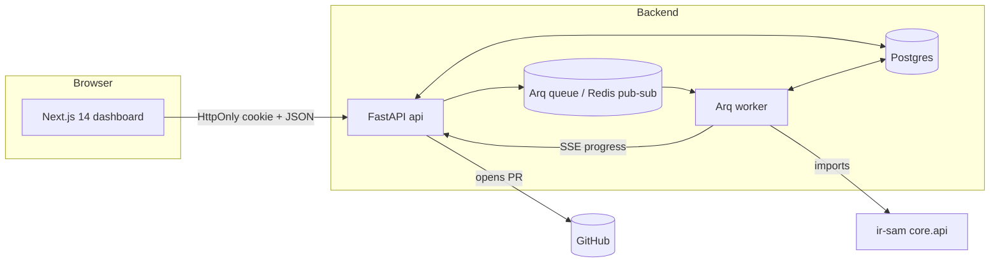

# IR-SAM — Provable SQL-Injection Repair Platform

> A self-hosted, single-user platform that detects taint-style injection sinks
> in your codebase and proposes **provably-safe** patches you can review, approve,
> and ship as a GitHub pull request — all from a modern web console.

This monorepo combines:

| Path           | What                                                                  |
| -------------- | --------------------------------------------------------------------- |
| `ir-sam/`      | Research core: detector, IR-SAM rewriter, validator, soundness proofs |
| `apps/api/`    | FastAPI service: auth, projects, scans, findings, patches, PRs        |
| `apps/worker/` | Arq worker: runs scans + patch generation + validator gates           |
| `apps/web/`    | Next.js 14 dashboard: dark premium UI, Monaco diff, live SSE          |
| `infra/`       | Docker Compose stack (Postgres + Redis + api + worker + web)          |
| `paper/`       | LaTeX manuscript                                                      |

---

## Architecture



- **Auth.** JWT in an `HttpOnly; SameSite=Lax` cookie (`irsam_session`). bcrypt 4.x.
- **Hardening.** slowapi rate-limit on `/auth/login`, security-headers middleware
  (CSP-ready, HSTS, X-Frame-Options, Referrer-Policy), Origin-guard against
  browser-issued cross-origin writes, append-only audit log.
- **Patches.** Generated diffs are reviewed in the UI (Monaco side-by-side diff)
  and only opened as PRs after explicit approval. GitHub tokens are **ephemeral**
  — never persisted server-side.

---

## Quick start (local Docker)

```bash
cp infra/.env.example infra/.env
# edit IRSAM_OWNER_EMAIL / IRSAM_OWNER_PASSWORD / IRSAM_JWT_SECRET / IRSAM_SECRETS_FERNET_KEY
cd infra
docker compose up --build
```

Then open <http://localhost:3000> and sign in with the owner credentials from
`infra/.env`.

To generate a Fernet key:

```bash
python -c "from cryptography.fernet import Fernet; print(Fernet.generate_key().decode())"
```

---

## Development

### Backend (FastAPI)

```bash
cd ir-sam && pip install -e ".[dev]"
cd ../apps/api && pip install -e ".[dev]"

# Run tests (uses in-memory SQLite, inline queue)
cd apps/api && pytest -q
```

### Worker (Arq)

```bash
cd apps/worker && pip install -e .
arq irsam_worker.tasks.WorkerSettings
```

### Frontend (Next.js 14)

```bash
cd apps/web
npm install
npm run dev               # http://localhost:3000
npm run typecheck
npm run lint
npm run build
npm run e2e               # Playwright smoke (requires built app on port 3100)
```

The dev server proxies `/api/*` to `http://localhost:8000` (set in
`next.config.mjs`) so the HttpOnly session cookie stays same-origin.

---

## Configuration

All backend settings are read from environment variables prefixed `IRSAM_`
(loaded from `apps/api/.env` or `infra/.env`):

| Variable                  | Purpose                                  |
| ------------------------- | ---------------------------------------- |
| `IRSAM_DATABASE_URL`      | Async SQLAlchemy URL (Postgres in prod)  |
| `IRSAM_REDIS_URL`         | Redis URL for Arq queue                  |
| `IRSAM_JWT_SECRET`        | HS256 signing secret                     |
| `IRSAM_SECRETS_FERNET_KEY`| Fernet key for encrypting stored secrets |
| `IRSAM_OWNER_EMAIL`       | Seed owner email                         |
| `IRSAM_OWNER_PASSWORD`    | Seed owner password (bootstraps on first run) |
| `IRSAM_COOKIE_SECURE`     | `true` behind TLS                        |
| `IRSAM_ALLOWED_ORIGINS`   | JSON list, e.g. `["https://app.example.com"]` |
| `IRSAM_QUEUE_BACKEND`     | `arq` (default) or `inline` (tests)      |
| `IRSAM_GITHUB_API_BASE`   | Override for GitHub Enterprise           |

See `infra/.env.example` for the full list and safe defaults.

---

## Testing matrix

| Suite                 | Command                                       | Status |
| --------------------- | --------------------------------------------- | ------ |
| ir-sam core           | `cd ir-sam && pytest -q`                      | 115 ✓  |
| apps/api              | `cd apps/api && pytest -q`                    | 15 ✓   |
| apps/web typecheck    | `cd apps/web && npm run typecheck`            | ✓      |
| apps/web build        | `cd apps/web && npm run build`                | ✓      |
| apps/web e2e smoke    | `cd apps/web && npm run e2e`                  | ✓      |

CI runs all of the above on every push / PR (see `.github/workflows/ci.yml`).

---

## Security model

- Single-owner deployment. RBAC beyond owner is out of scope for v1.
- HttpOnly session cookie, SameSite=Lax, 12h TTL.
- bcrypt password hashing (cost 12, 72-byte truncation handled explicitly).
- Login rate-limit: 10 / minute per source IP.
- GitHub PATs are accepted per-request and **never persisted**.
- Project-scoped secrets (SSH keys, repo tokens for `git clone`) are
  Fernet-encrypted at rest.
- Append-only audit log: login success/failure, project create/delete,
  patch decisions, PRs opened.

Reporting vulnerabilities: please open a private security advisory on GitHub.

---

## License

Apache-2.0 — see `ir-sam/LICENSE`.
